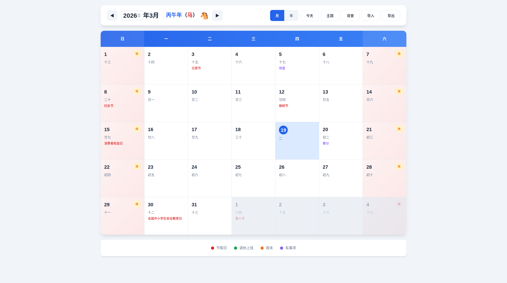
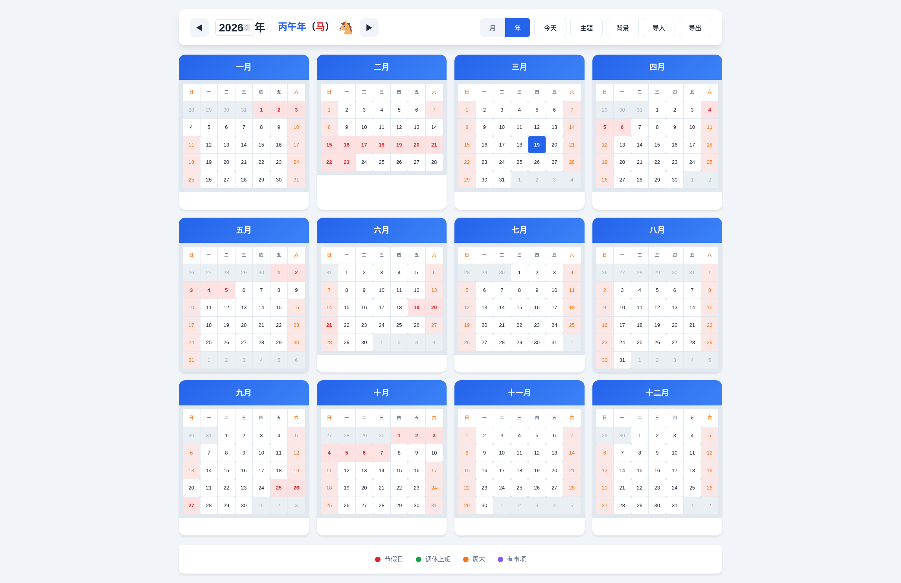
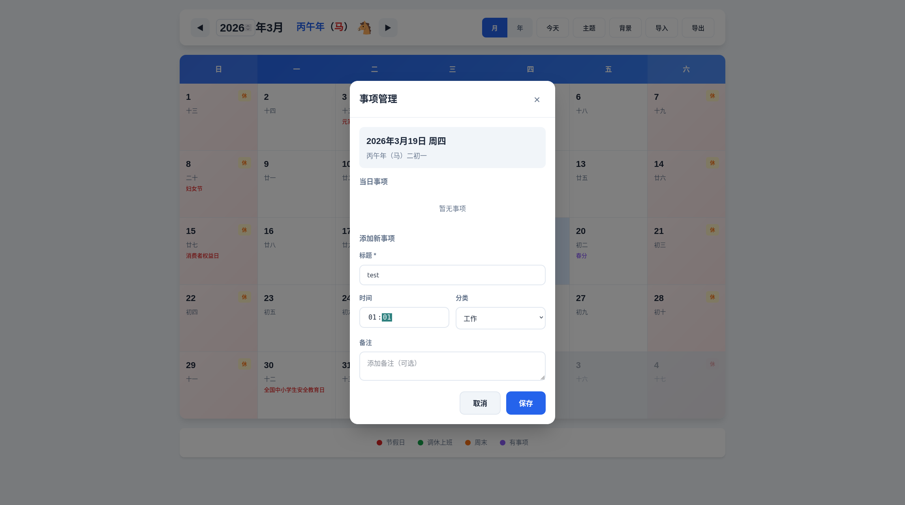

# 万年历系统

> 🌟 纯Web前端实现，无需服务器，打开即用，自动同步法定假期

## 核心特点

### ✅ 纯Web前端
- 零后端依赖，无需搭建服务器
- 无需数据库，无需API密钥
- 单HTML文件 + 静态资源，部署简单
- 可直接双击 `index.html` 在浏览器中打开使用

### ✅ 打开即用
- 无需注册登录
- 无需配置任何参数
- 无需安装任何依赖
- 支持离线使用（基础功能）

### ✅ 自动更新假期
- 每年首次打开自动联网获取最新法定节假日数据
- 数据来源可靠：timor.tech API + holiday-cn GitHub仓库
- 本地缓存策略：当前年份缓存到年底，历史年份缓存30天
- 智能判断：未来年份自动使用离线模式（法定假期尚未发布）

### ✅ 数据本地存储
- 所有事项数据存储在浏览器 LocalStorage
- 支持导出JSON文件备份
- 支持导入恢复数据
- 数据完全由用户掌控

## 功能特性

| 功能 | 说明 |
|-----|------|
| 日历视图 | 月视图、年视图自由切换 |
| 农历显示 | 农历日期、节气、传统节日 |
| 节假日标识 | 法定节假日、调休上班、周末 |
| 事项管理 | 添加、编辑、删除日程事项 |
| 多套主题 | 6套配色主题（蓝/暗黑/绿/紫/红/橙） |
| 自定义背景 | 上传图片作为日历背景 |
| 年份选择 | 支持公元1年-9999年 |
| 十二生肖 | 根据农历年份显示生肖图标 |

## 页面截图

### 月视图


### 年视图


### 事项管理


## 快速开始

### 方式一：直接打开（推荐）
```bash
# 双击 index.html 文件即可在浏览器中打开使用
```

### 方式二：本地服务器
```bash
cd calendar
python3 -m http.server 8080
# 访问 http://localhost:8080
```

### 方式三：部署到静态托管
直接上传到任意静态网站托管平台：
- GitHub Pages
- Vercel
- Netlify
- Cloudflare Pages

## 节假日数据说明

### 数据来源
| 数据源 | 类型 | 说明 |
|-------|------|------|
| timor.tech API | 在线API | 免费节假日API，支持2013-当前年份 |
| holiday-cn | GitHub仓库 | 自动抓取国务院公告，支持2007-2027年 |
| lunar-javascript | 本地内置 | 离线备份数据，支持2001-2025年 |

### 自动更新机制
```
用户打开万年历
    ↓
判断查看年份
    ↓
当前/历史年份 → 检查本地缓存
    ↓ 无缓存
联网获取节假日数据
    ↓ 成功
缓存到 LocalStorage
    ↓
显示完整节假日信息

未来年份 → 使用离线模式（周末判断）
```

### 缓存策略
| 年份类型 | 缓存有效期 |
|---------|-----------|
| 当前年份 | 到当年12月31日23:59:59 |
| 历史年份 | 30天 |
| 未来年份 | 不缓存（离线模式） |

## 技术栈

| 技术 | 用途 |
|-----|------|
| 原生 HTML/CSS/JS | 核心框架 |
| lunar-javascript | 农历计算库 |
| LocalStorage | 本地数据存储 |
| Fetch API | 联网获取数据 |

## 目录结构

```
calendar/
├── index.html          # 主页面（直接打开即可使用）
├── css/
│   └── style.css       # 样式文件
├── js/
│   ├── app.js          # 主逻辑
│   ├── calendar.js     # 日历渲染
│   ├── lunar.js        # 农历计算
│   ├── holiday.js      # 节假日服务（自动联网更新）
│   ├── events.js       # 事项管理
│   ├── storage.js      # 本地存储
│   └── export.js       # 导入导出
├── images/             # 背景图片目录
├── pic/                # 页面截图
└── README.md           # 说明文档
```

## 常见问题

### Q: 需要联网吗？
**A:** 首次使用建议联网以获取最新节假日数据。联网失败或查看未来年份时自动使用离线模式。

### Q: 数据会丢失吗？
**A:** 数据存储在浏览器 LocalStorage 中，只要不清除浏览器数据就不会丢失。建议定期导出JSON备份。

### Q: 支持哪些年份？
**A:** 支持公元1年-9999年。节假日数据支持2001年至今，更早年份使用离线模式。

### Q: 可以在手机上使用吗？
**A:** 可以，完全响应式设计，支持手机、平板、电脑。

## License

MIT